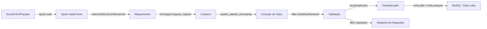

# Requirements

### Overview & Goals

Criar o arquivo `/docs/bigdata.md` com uma proposta completa de pipeline alternativo utilizando técnicas de Big Data (PySpark) para o projeto ETL existente. O documento servirá como guia de referência para uma futura implementação que permita processar volumes de dados muito maiores do que o pipeline atual suporta.

### Scope

#### In Scope
- Criação do arquivo `/docs/bigdata.md` com documentação técnica completa
- Mapeamento das etapas atuais do pipeline (Extract → Transform → Load) para equivalentes em PySpark
- Proposta de arquitetura Big Data baseada no domínio existente (agendamentos médicos)
- Exemplos de código PySpark para cada etapa do pipeline
- Comparativo entre a abordagem atual (Python puro + MySQL) e a proposta Big Data
- Instruções de configuração e deploy com PySpark

#### Out of Scope
- Alteração de qualquer arquivo existente no projeto
- Implementação efetiva do pipeline Big Data
- Criação de testes ou código executável

### Functional Requirements

1. O documento deve descrever a motivação para adotar Big Data no contexto do pipeline atual
2. O documento deve apresentar a arquitetura proposta com PySpark, mapeando cada módulo existente (`etl/extract.py`, `etl/transform/`, `etl/load/`) para seu equivalente Spark
3. O documento deve conter exemplos de código PySpark para:
   - Leitura de arquivos Excel/CSV/Parquet
   - Transformações (mapeamento, limpeza, coerção de tipos, validação, deduplicação)
   - Carga no MySQL e em formatos distribuídos (Parquet, Delta Lake)
4. O documento deve incluir um exemplo de configuração e execução
5. O documento deve apresentar um comparativo de performance e escalabilidade
6. O documento deve seguir o padrão de documentação existente em `docs/` (Markdown em pt_BR)

# Technical Design

### Current Implementation

O pipeline ETL atual está organizado em módulos Python:

 Módulo | Responsabilidade |
--------|------------------|
 `etl/extract.py` | Leitura streaming de Excel (.xlsx/.xls) via openpyxl/xlrd |
 `etl/transform/mapping.py` | Mapeamento de colunas origem → destino |
 `etl/transform/cleaning.py` | Limpeza e normalização (trim, upper, etc.) |
 `etl/transform/types.py` | Coerção de tipos (int, decimal, date, etc.) |
 `etl/transform/validation.py` | Validação (required, ranges, max_lengths) |
 `etl/transform/dedup.py` | Deduplicação por chave de negócio |
 `etl/load/loader.py` | Carga em lote no MySQL (append/truncate/upsert) |
 `etl/load/connection.py` | Gerenciamento de conexão MySQL com retry |
 `etl/pipeline.py` | Orquestrador: chunked reading → transform → batch load |
 `etl/config.py` | Configuração JSON com dataclasses |
 `etl/cli.py` | Interface CLI com argparse |

O pipeline suporta:
- Leitura em blocos (`chunk_size`) para eficiência de memória
- Processamento paralelo via `ProcessPoolExecutor` (`workers`)
- Carga assíncrona via `ThreadPoolExecutor`
- Checkpoint para retomada de execuções interrompidas
- Tabelas fato + dimensão com deduplicação centralizada

### Proposed Content Structure for `/docs/bigdata.md`

O documento será estruturado nas seguintes seções:

1. **Introdução e Motivação** — por que considerar Big Data; limites do pipeline atual
2. **Visão Geral da Arquitetura PySpark** — diagrama e fluxo E→T→L com Spark
3. **Mapeamento Pipeline Atual → PySpark** — tabela comparativa módulo a módulo
4. **Extração com PySpark** — leitura de Excel, CSV e Parquet com `spark.read`
5. **Transformação com PySpark** — exemplos de cada etapa usando DataFrame API
6. **Carga com PySpark** — gravação no MySQL via JDBC e em Parquet/Delta Lake
7. **Configuração e Execução** — `spark-submit`, dependências, configuração
8. **Comparativo Performance** — tabela Python puro vs PySpark para diferentes volumes
9. **Considerações de Deploy** — Docker, cluster, cloud (EMR/Dataproc)
10. **Próximos Passos** — roadmap para adoção gradual

### Architecture Diagram (to be included in the document)

### Key Decisions

1. **PySpark como framework de referência** — é o padrão de facto para Big Data em Python, compatível com o ecossistema do projeto
2. **Manter compatibilidade conceitual** — o documento mapeia 1:1 os conceitos do pipeline atual (chunk → partition, clean_row → withColumn, etc.)
3. **Incluir múltiplos destinos** — além do MySQL via JDBC, documentar Parquet e Delta Lake como alternativas para data lakes
4. **Documentação apenas** — nenhum arquivo existente será alterado; o artefato é exclusivamente `/docs/bigdata.md`

### File Structure

 Ação | Arquivo |
------|---------|
 **Criar** | `/docs/bigdata.md` |

Nenhum outro arquivo do projeto será modificado.

# Delivery Steps

### ✓ Step 1: Criar estrutura base e seções introdutórias do bigdata.md
O arquivo `/docs/bigdata.md` existe com título, introdução, motivação e visão geral da arquitetura PySpark.

- Criar o arquivo `/docs/bigdata.md`
- Escrever a seção **Introdução e Motivação**: explicar os limites do pipeline atual (Python puro, processamento single-node, memória proporcional ao chunk) e por que Big Data é relevante para escalar além de milhões de linhas
- Escrever a seção **Visão Geral da Arquitetura PySpark**: incluir diagrama mermaid mostrando o fluxo E→T→L com Spark, explicar os conceitos de DataFrame, particionamento, e lazy evaluation
- Escrever a seção **Mapeamento Pipeline Atual → PySpark**: tabela comparativa mapeando cada módulo existente (`extract.py` → `spark.read`, `cleaning.py` → `withColumn + trim/upper`, `types.py` → `cast()`, `validation.py` → `filter()`, `dedup.py` → `dropDuplicates()`, `loader.py` → `write.jdbc()`) ao equivalente Spark

### ✓ Step 2: Adicionar seções de Extração e Transformação com exemplos PySpark
O documento contém exemplos de código PySpark detalhados para as etapas de extração e transformação.

- Escrever a seção **Extração com PySpark**: exemplos de `spark.read.format('com.crealytics.spark.excel')` para Excel, `spark.read.csv()` para CSV, e `spark.read.parquet()` para Parquet, com parâmetros equivalentes ao `SourceConfig` atual (sheet, header_row, inferSchema)
- Escrever a seção **Transformação com PySpark** contendo subseções:
  - **Mapeamento de colunas**: exemplo com `select()` e `withColumnRenamed()` equivalente ao `apply_mapping()`
  - **Limpeza e Normalização**: exemplo com `trim()`, `upper()`, `regexp_replace()` equivalente ao `clean_row()`
  - **Coerção de Tipos**: exemplo com `cast()`, `to_date()`, `to_timestamp()` equivalente ao `coerce_row()`
  - **Validação**: exemplo com `filter()` para separar linhas válidas e rejeitadas, equivalente ao `validate_row()`
  - **Deduplicação**: exemplo com `dropDuplicates()` equivalente ao `Deduplicator`
- Todos os exemplos devem usar o domínio real do projeto (tabelas `tb_agendamentos`, `tb_beneficiarios`, `tb_profissionais`, `tb_especialidades`)

### ✓ Step 3: Adicionar seções de Carga, Configuração, Comparativo e Deploy
O documento está completo com todas as seções: carga, configuração/execução, comparativo de performance e considerações de deploy.

- Escrever a seção **Carga com PySpark**:
  - Exemplo de `write.jdbc()` para MySQL com parâmetros de conexão equivalentes ao `DatabaseConfig` atual
  - Modos de carga: `mode('append')`, `mode('overwrite')` mapeados para os modos `append`/`truncate` atuais
  - Alternativas: gravação em Parquet e Delta Lake para cenários de data lake
- Escrever a seção **Configuração e Execução**:
  - Dependências necessárias (`pyspark`, conectores JDBC, spark-excel)
  - Exemplo de `spark-submit` com configuração de memória e paralelismo
  - Exemplo de configuração JSON adaptada para o modo Big Data
- Escrever a seção **Comparativo de Performance**: tabela comparando Python puro vs PySpark para volumes de 10K, 100K, 1M e 10M+ linhas (memória, tempo, paralelismo)
- Escrever a seção **Considerações de Deploy**: execução local, Docker com Spark, clusters na nuvem (AWS EMR, GCP Dataproc)
- Escrever a seção **Próximos Passos**: roadmap sugerido para adoção incremental (converter extração primeiro, depois transformação, depois carga)
- Revisar o documento completo para consistência de estilo (pt_BR) e formatação Markdown