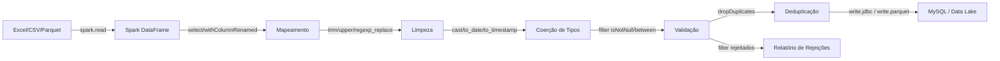

# Pipeline Big Data com PySpark

Proposta de pipeline alternativo utilizando Apache Spark (PySpark) para processar volumes de dados significativamente maiores do que o pipeline ETL atual suporta.

---

## 1. Introdução e Motivação

O pipeline ETL atual foi projetado para processar planilhas Excel de agendamentos médicos e carregá-las em um banco de dados MySQL. Ele utiliza Python puro com as bibliotecas `openpyxl`/`xlrd` para leitura, transformações em dicionários Python, e inserção em lotes via `mysql-connector-python`.

### Limites do Pipeline Atual

Embora o pipeline atual já implemente estratégias de eficiência — leitura em blocos (`chunk_size`), paralelismo via `ProcessPoolExecutor` e carga assíncrona via `ThreadPoolExecutor` — ele possui limitações intrínsecas:

| Limitação | Descrição |
|-----------|-----------|
| **Single-node** | Todo o processamento ocorre em uma única máquina; não há distribuição de carga entre servidores. |
| **Memória proporcional ao chunk** | Cada bloco de linhas (`chunk_size=5000`) é mantido em memória como dicionários Python, que consomem significativamente mais memória do que formatos colunares. |
| **Paralelismo limitado** | O `ProcessPoolExecutor` distribui chunks entre processos locais, mas não escala além dos núcleos da máquina. |
| **Formato de entrada restrito** | A leitura de Excel via `openpyxl` é inerentemente lenta; formatos colunares como Parquet não são suportados nativamente. |
| **Throughput de carga** | A inserção no MySQL via `executemany` em lotes de 1.000–5.000 linhas é eficiente para volumes moderados, mas se torna gargalo acima de milhões de registros. |

Para volumes acima de **1 milhão de linhas**, o tempo de processamento cresce linearmente e o consumo de memória pode se tornar proibitivo. Cenários com **10 milhões ou mais de registros** — comuns em redes de saúde com múltiplas unidades — exigem uma abordagem distribuída.

### Por que PySpark?

O Apache Spark é o framework de facto para processamento distribuído de grandes volumes de dados. O PySpark, sua interface Python, permite aproveitar o ecossistema existente do projeto (Python, MySQL) enquanto oferece:

- **Processamento distribuído**: dados particionados automaticamente entre múltiplos nós de um cluster.
- **Lazy evaluation**: transformações são planejadas e otimizadas antes da execução, evitando passes desnecessários sobre os dados.
- **Formatos colunares nativos**: suporte a Parquet e Delta Lake, que oferecem compressão e leitura seletiva de colunas.
- **API familiar**: a DataFrame API do Spark é semelhante à manipulação de dados em Python/Pandas.
- **Escalabilidade horizontal**: basta adicionar nós ao cluster para processar volumes maiores.

---

## 2. Visão Geral da Arquitetura PySpark

### Fluxo do Pipeline

O pipeline Big Data segue o mesmo fluxo conceitual **Extração → Transformação → Carga** do pipeline atual, mas cada etapa é executada de forma distribuída pelo Spark:



### Conceitos Fundamentais

#### DataFrame
O `DataFrame` do Spark é uma coleção distribuída de dados organizados em colunas tipadas, semelhante a uma tabela de banco de dados. Diferente dos dicionários Python usados no pipeline atual, o DataFrame é armazenado em formato colunar otimizado e particionado entre os nós do cluster.

#### Particionamento
No pipeline atual, os dados são divididos em chunks de tamanho fixo (`chunk_size=5000`) para controlar o consumo de memória. No Spark, o particionamento é automático: ao ler um arquivo, o Spark divide os dados em **partições** que são processadas em paralelo por diferentes executores. O número de partições pode ser controlado via `repartition()` ou `coalesce()`.

#### Lazy Evaluation
No pipeline atual, cada transformação (`apply_mapping`, `clean_row`, `coerce_row`, `validate_row`) é aplicada imediatamente linha a linha. No Spark, as transformações são **registradas** mas não executadas até que uma **ação** (como `write` ou `count`) seja chamada. Isso permite ao Spark otimizar o plano de execução, combinando operações e minimizando a movimentação de dados entre nós.

#### SparkSession
O ponto de entrada para qualquer aplicação PySpark é a `SparkSession`, equivalente ao papel do `EtlConfig` como configuração central:

```python
from pyspark.sql import SparkSession

spark = SparkSession.builder \
    .appName("ETL Agendamentos - Big Data") \
    .config("spark.sql.shuffle.partitions", "200") \
    .config("spark.executor.memory", "4g") \
    .getOrCreate()
```

---

## 3. Mapeamento Pipeline Atual → PySpark

A tabela abaixo mapeia cada módulo do pipeline atual ao seu equivalente na arquitetura PySpark:

| Módulo Atual | Função Principal | Equivalente PySpark | API Spark |
|---|---|---|---|
| `etl/extract.py` | Leitura streaming de Excel (.xlsx/.xls) via openpyxl/xlrd | `spark.read` com conector spark-excel, CSV ou Parquet | `spark.read.format("com.crealytics.spark.excel")`, `spark.read.csv()`, `spark.read.parquet()` |
| `etl/transform/mapping.py` | Mapeamento de colunas origem → destino (`apply_mapping`) | Renomeação e seleção de colunas no DataFrame | `df.select()`, `df.withColumnRenamed()` |
| `etl/transform/cleaning.py` | Limpeza: trim, upper, strip_punctuation, collapse_spaces (`clean_row`) | Funções de string aplicadas em colunas | `F.trim()`, `F.upper()`, `F.regexp_replace()` |
| `etl/transform/types.py` | Coerção de tipos: int, decimal, date, datetime, bool (`coerce_row`) | Cast de tipos no DataFrame | `df.cast()`, `F.to_date()`, `F.to_timestamp()` |
| `etl/transform/validation.py` | Validação: required, ranges, max_lengths (`validate_row`) | Filtros condicionais separando válidos/rejeitados | `df.filter()`, `F.col().isNotNull()`, `F.col().between()` |
| `etl/transform/dedup.py` | Deduplicação por chave de negócio (`Deduplicator`) | Remoção de duplicatas nativas | `df.dropDuplicates(["chave1", "chave2"])` |
| `etl/load/loader.py` | Carga em lote no MySQL (append/truncate/upsert) | Gravação via JDBC ou em formatos distribuídos | `df.write.jdbc()`, `df.write.parquet()`, `df.write.format("delta")` |
| `etl/load/connection.py` | Conexão MySQL com retry e backoff | Configuração JDBC no `write.jdbc()` | Propriedades JDBC: `url`, `driver`, `user`, `password` |
| `etl/pipeline.py` | Orquestrador: chunked reading → transform → batch load | Script PySpark com encadeamento de transformações | Encadeamento: `spark.read → .transform() → .write` |
| `etl/config.py` | Configuração JSON com dataclasses (`EtlConfig`) | Configuração via `SparkSession` + JSON/YAML | `SparkSession.builder.config()` |
| `etl/cli.py` | Interface CLI com argparse | `spark-submit` com argumentos | `spark-submit --master ... app.py config.json` |

### Correspondência de Conceitos

| Conceito Atual | Conceito PySpark |
|---|---|
| `chunk_size` (bloco de linhas) | Partição (automática ou via `repartition`) |
| `ProcessPoolExecutor` (paralelismo local) | Executores Spark (paralelismo distribuído) |
| `ThreadPoolExecutor` (carga assíncrona) | Paralelismo nativo do `write.jdbc()` |
| `checkpoint.json` (retomada) | Spark Checkpointing / Delta Lake time travel |
| `rejeicoes.csv` (relatório) | DataFrame de rejeições gravado em Parquet/CSV |
| `batch_size` (lote de inserção) | `batchsize` no `write.jdbc()` |
| Dicionários Python (linha) | Row / DataFrame (colunar, distribuído) |

---

## 4. Extração com PySpark

No pipeline atual, a extração é feita pelo módulo `etl/extract.py`, que lê arquivos Excel (.xlsx/.xls) em blocos usando `openpyxl` ou `xlrd`. No PySpark, a leitura é feita via `spark.read`, que suporta múltiplos formatos nativamente.

### Leitura de Excel

Para ler arquivos Excel no Spark, utiliza-se o conector [spark-excel](https://github.com/crealytics/spark-excel) da Crealytics, que deve ser adicionado como dependência:

```python
# Equivalente ao SourceConfig atual:
#   path: "agendaAnonimizado.xlsx"
#   sheet: "AGENDA_1"
#   header_row: 1

df_excel = spark.read \
    .format("com.crealytics.spark.excel") \
    .option("header", "true") \
    .option("dataAddress", "'AGENDA_1'!A1") \
    .option("inferSchema", "true") \
    .load("agendaAnonimizado.xlsx")
```

> **Nota:** A leitura de Excel no Spark é adequada para arquivos de até algumas centenas de milhares de linhas. Para volumes maiores, recomenda-se converter o Excel para CSV ou Parquet antes do processamento (veja abaixo).

### Leitura de CSV

O CSV é um formato intermediário útil quando os dados são exportados de sistemas legados. O Spark lê CSVs nativamente com excelente performance:

```python
df_csv = spark.read \
    .option("header", "true") \
    .option("inferSchema", "true") \
    .option("delimiter", ";") \
    .option("encoding", "UTF-8") \
    .csv("dados/agendamentos.csv")
```

### Leitura de Parquet (Recomendado para Big Data)

O Parquet é um formato colunar binário que oferece compressão eficiente e leitura seletiva de colunas. É o formato ideal para pipelines Big Data:

```python
df_parquet = spark.read.parquet("dados/agendamentos.parquet")

# Leitura com seleção de colunas (pushdown) — lê apenas as colunas necessárias
df_parquet = spark.read \
    .parquet("dados/agendamentos.parquet") \
    .select("id_agendamento", "benef_id", "prof_id", "data", "status")
```

### Comparativo de Formatos de Entrada

| Formato | Velocidade de Leitura | Compressão | Suporte Nativo Spark | Recomendação |
|---------|----------------------|------------|---------------------|--------------|
| Excel (.xlsx) | Lenta | Nenhuma | Via conector externo | Apenas para migração inicial |
| CSV | Média | Nenhuma (sem gzip) | Nativo | Boa para interoperabilidade |
| Parquet | Rápida | Snappy/Gzip nativo | Nativo | **Ideal para Big Data** |

---

## 5. Transformação com PySpark

No pipeline atual, as transformações são aplicadas linha a linha por funções Python (`apply_mapping`, `clean_row`, `coerce_row`, `validate_row`). No PySpark, as mesmas operações são expressas como transformações em colunas do DataFrame, aplicadas de forma distribuída a todas as partições simultaneamente.

```python
from pyspark.sql import functions as F
from pyspark.sql.types import (
    IntegerType, LongType, DecimalType, TimestampType, DateType, StringType
)
```

### 5.1 Mapeamento de Colunas

Equivalente ao `apply_mapping()` de `etl/transform/mapping.py`, que transforma os nomes das colunas de origem (planilha) para os nomes de destino (banco de dados):

```python
# Mapeamento de colunas — equivalente ao mapping.json do projeto
# Exemplo com as principais colunas da tb_agendamentos
column_mapping = {
    "AG_ID": "id_agendamento",
    "TIPOAGENDA": "tipoagenda",
    "AG_DTHORAAGENDA": "ag_dthoraagenda",
    "DTHORAAGENDA": "data_hora",
    "DATA": "data",
    "AG_STATUSAGENDAMENTO": "status",
    "PROF_ID": "prof_id",
    "PROF_NOME": "prof_nome",
    "ESP_ID": "esp_id",
    "ESP_DESCRICAO": "esp_descricao",
    "BENEF_ID": "benef_id",
    "BENEF_NOME": "paciente_nome",
    "BENEF_CPF": "benef_cpf",
    "BENEF_DTNASC": "benef_dtnasc",
    "AGP_VALOR": "valor",
}

# Aplicar o mapeamento usando select + alias
df_mapped = df_excel.select(
    [F.col(source).alias(target) for source, target in column_mapping.items()]
)

# Alternativa usando withColumnRenamed (útil para renomear poucas colunas)
df_mapped = df_excel
for source, target in column_mapping.items():
    df_mapped = df_mapped.withColumnRenamed(source, target)
```

### 5.2 Limpeza e Normalização

Equivalente ao `clean_row()` de `etl/transform/cleaning.py`, que aplica trim, conversão para maiúsculas, remoção de pontuação e colapso de espaços:

```python
# Colunas de texto que precisam de limpeza
text_columns = [
    "paciente_nome", "prof_nome", "esp_descricao", "status",
    "benef_nomesocial", "benef_nomeafetivo", "benef_bairro",
]

# 1. Trim em todas as colunas de texto (equivalente ao strip() do clean_row)
for col_name in text_columns:
    df_clean = df_mapped.withColumn(col_name, F.trim(F.col(col_name)))

# 2. Converter strings vazias para null (equivalente ao "if not value: value = None")
for col_name in text_columns:
    df_clean = df_clean.withColumn(
        col_name,
        F.when(F.col(col_name) == "", None).otherwise(F.col(col_name))
    )

# 3. Normalização upper (equivalente ao normalizer "upper" no config)
upper_columns = ["paciente_nome", "prof_nome", "esp_descricao"]
for col_name in upper_columns:
    df_clean = df_clean.withColumn(col_name, F.upper(F.col(col_name)))

# 4. Remoção de pontuação (equivalente ao normalizer "strip_punctuation")
df_clean = df_clean.withColumn(
    "benef_cpf",
    F.regexp_replace(F.col("benef_cpf"), r"[.\-/]", "")
)

# 5. Colapso de espaços múltiplos (equivalente ao normalizer "collapse_spaces")
for col_name in upper_columns:
    df_clean = df_clean.withColumn(
        col_name,
        F.regexp_replace(F.col(col_name), r"\s+", " ")
    )
```

### 5.3 Coerção de Tipos

Equivalente ao `coerce_row()` de `etl/transform/types.py`, que converte valores brutos nos tipos esperados pelo banco de dados:

```python
# Coerção de tipos — equivalente ao "types" do mapping.json
# Exemplo baseado nos tipos reais do projeto:
#   "id_agendamento": "int", "ag_dthoraagenda": "datetime",
#   "valor": "decimal", "data": "datetime", "prof_status": "int"

# Inteiros (equivalente a coerce_value com target_type="int")
int_columns = [
    "id_agendamento", "tipoagenda", "ag_pendente", "prof_id",
    "esp_id", "benef_id", "prof_status", "esp_corporativo",
]
for col_name in int_columns:
    df_typed = df_clean.withColumn(col_name, F.col(col_name).cast(LongType()))

# Decimais (equivalente a coerce_value com target_type="decimal")
df_typed = df_typed.withColumn("valor", F.col("valor").cast(DecimalType(15, 2)))

# Datetime (equivalente a coerce_value com target_type="datetime")
datetime_columns = [
    "ag_dthoraagenda", "data", "ag_dthoraatendimento",
    "ag_dthoracancel", "ag_dthoratransf",
]
for col_name in datetime_columns:
    df_typed = df_typed.withColumn(col_name, F.col(col_name).cast(TimestampType()))

# Date (equivalente a coerce_value com target_type="date")
df_typed = df_typed.withColumn("benef_dtnasc", F.to_date(F.col("benef_dtnasc")))

# Tratamento de datas em formato string brasileiro (dd/MM/yyyy)
df_typed = df_typed.withColumn(
    "benef_dtnasc",
    F.coalesce(
        F.to_date(F.col("benef_dtnasc"), "yyyy-MM-dd"),
        F.to_date(F.col("benef_dtnasc"), "dd/MM/yyyy"),
    )
)
```

### 5.4 Validação

Equivalente ao `validate_row()` de `etl/transform/validation.py`, que verifica campos obrigatórios, faixas de valores e comprimentos máximos. No Spark, a validação é feita com `filter()`, separando linhas válidas e rejeitadas:

```python
# --- Campos obrigatórios (equivalente ao config.required) ---
required_columns = ["id_agendamento", "benef_id", "data"]

required_condition = F.lit(True)
for col_name in required_columns:
    required_condition = required_condition & F.col(col_name).isNotNull()

# --- Faixas de valores (equivalente ao config.ranges) ---
range_condition = F.when(
    F.col("valor").isNotNull(),
    F.col("valor") >= 0
).otherwise(True)

# --- Comprimento máximo (equivalente ao config.max_lengths) ---
length_condition = F.when(
    F.col("paciente_nome").isNotNull(),
    F.length(F.col("paciente_nome")) <= 255
).otherwise(True)

# Condição combinada de validação
all_valid = required_condition & range_condition & length_condition

# Separar linhas válidas e rejeitadas
df_valid = df_typed.filter(all_valid)
df_rejected = df_typed.filter(~all_valid)

# Gerar relatório de rejeições (equivalente ao rejeicoes.csv)
# Adiciona coluna com motivo da rejeição para facilitar análise
df_rejected_report = df_rejected.withColumn(
    "motivo_rejeicao",
    F.concat_ws("; ",
        F.when(F.col("id_agendamento").isNull(), F.lit("id_agendamento é obrigatório")),
        F.when(F.col("benef_id").isNull(), F.lit("benef_id é obrigatório")),
        F.when(F.col("data").isNull(), F.lit("data é obrigatório")),
        F.when(
            F.col("valor").isNotNull() & (F.col("valor") < 0),
            F.lit("valor fora do intervalo permitido")
        ),
        F.when(
            F.col("paciente_nome").isNotNull() & (F.length(F.col("paciente_nome")) > 255),
            F.lit("paciente_nome excede comprimento máximo")
        ),
    )
)

# Gravar relatório de rejeições
df_rejected_report.select(
    "id_agendamento", "benef_id", "data", "motivo_rejeicao"
).write.mode("overwrite").csv("output/rejeicoes", header=True)
```

### 5.5 Deduplicação

Equivalente ao `Deduplicator` de `etl/transform/dedup.py`, que elimina registros duplicados com base em chaves de negócio:

```python
# Deduplicação por chave de negócio
# Equivalente à business_key do config.json: ["id_agendamento", "benef_id", "data_hora"]
business_key = ["id_agendamento", "benef_id", "data_hora"]

# Opção 1: dropDuplicates — mantém a primeira ocorrência (equivalente a on_duplicate="discard")
df_dedup = df_valid.dropDuplicates(business_key)

# Opção 2: Com janela para manter o registro mais recente
from pyspark.sql.window import Window

window = Window.partitionBy(business_key).orderBy(F.col("data").desc())
df_dedup = df_valid \
    .withColumn("_row_num", F.row_number().over(window)) \
    .filter(F.col("_row_num") == 1) \
    .drop("_row_num")

# Opção 3: Reportar duplicatas (equivalente a on_duplicate="report")
df_duplicates = df_valid.exceptAll(df_dedup)
df_duplicates.write.mode("overwrite").csv("output/duplicatas", header=True)

# Log de contagens (equivalente aos logs do pipeline atual)
total = df_typed.count()
valid = df_valid.count()
dedup = df_dedup.count()
rejected = df_rejected.count()
print(f"Total: {total} | Válidos: {valid} | Deduplicados: {dedup} | Rejeitados: {rejected}")
```

---

## 6. Carga com PySpark

No pipeline atual, a carga é feita pelo módulo `etl/load/loader.py`, que insere registros em lotes no MySQL via `executemany`. No PySpark, a gravação é feita via `write.jdbc()` para bancos relacionais ou `write.parquet()`/`write.format("delta")` para data lakes.

### 6.1 Carga no MySQL via JDBC

Equivalente ao `BatchLoader` do pipeline atual, com parâmetros de conexão mapeados do `DatabaseConfig`:

```python
# Propriedades de conexão — equivalentes ao DatabaseConfig atual
jdbc_url = "jdbc:mysql://savir005.vpshost12372.mysql.dbaas.com.br:3306/savir005"

jdbc_properties = {
    "user": "savir027",
    "password": "****",
    "driver": "com.mysql.cj.jdbc.Driver",
    "batchsize": "5000",           # equivalente ao batch_size=5000 do config.json
    "isolationLevel": "READ_COMMITTED",
    "numPartitions": "4",          # conexões paralelas ao MySQL
}

# --- Modo append (equivalente a load.mode="append") ---
df_dedup.write.jdbc(
    url=jdbc_url,
    table="tb_agendamentos",
    mode="append",
    properties=jdbc_properties,
)

# --- Modo truncate (equivalente a load.mode="truncate") ---
# O Spark não tem "truncate" nativo, mas overwrite com truncate=true preserva o schema
jdbc_properties_truncate = {**jdbc_properties, "truncateTable": "true"}

df_dedup.write.jdbc(
    url=jdbc_url,
    table="tb_agendamentos",
    mode="overwrite",
    properties=jdbc_properties_truncate,
)
```

### 6.2 Carga em Tabelas Dimensão

O pipeline atual suporta tabelas dimensão (`tb_beneficiarios`, `tb_profissionais`, `tb_especialidades`) com deduplicação centralizada. No PySpark, isso é feito extraindo subconjuntos do DataFrame principal:

```python
# --- Dimensão: tb_beneficiarios ---
df_beneficiarios = df_dedup.select(
    F.col("benef_id").alias("id_beneficiario"),
    F.col("benef_nomesocial").alias("nomesocial"),
    F.col("benef_nomeafetivo").alias("nomeafetivo"),
    F.col("paciente_nome").alias("nomepaciente"),
    F.col("benef_dtnasc").alias("dtnasc"),
    F.col("benef_cns").alias("cns"),
    F.col("benef_cpf").alias("cpf"),
    F.col("benef_rn").alias("rn"),
    F.col("benef_sexo").alias("sexo"),
    F.col("benef_temporario").alias("temporario"),
    F.col("benef_bairro").alias("bairro"),
).dropDuplicates(["id_beneficiario"])

df_beneficiarios.write.jdbc(
    url=jdbc_url, table="tb_beneficiarios", mode="append", properties=jdbc_properties
)

# --- Dimensão: tb_profissionais ---
df_profissionais = df_dedup.select(
    F.col("prof_id").alias("id_profissional"),
    F.col("esp_id"),
    F.col("prof_nome").alias("nome"),
    F.col("prof_conselhonum").alias("conselhonum"),
    F.col("prof_conselhouf").alias("conselhouf"),
    F.col("prof_sexo").alias("sexo"),
    F.col("prof_status").alias("status"),
    F.col("prof_corporativo").alias("corporativo"),
).dropDuplicates(["id_profissional"])

df_profissionais.write.jdbc(
    url=jdbc_url, table="tb_profissionais", mode="append", properties=jdbc_properties
)

# --- Dimensão: tb_especialidades ---
df_especialidades = df_dedup.select(
    F.col("esp_id").alias("id_especialidade"),
    F.col("esp_descricao").alias("descricao"),
    F.col("esp_corporativo").alias("corporativo"),
    F.col("esp_cmed").alias("cmed"),
).dropDuplicates(["id_especialidade"])

df_especialidades.write.jdbc(
    url=jdbc_url, table="tb_especialidades", mode="append", properties=jdbc_properties
)
```

### 6.3 Alternativas: Parquet e Delta Lake

Para cenários de data lake, os dados podem ser gravados em formatos distribuídos ao invés de (ou além de) MySQL:

```python
# --- Parquet (formato colunar comprimido) ---
df_dedup.write \
    .mode("overwrite") \
    .partitionBy("data") \
    .parquet("output/agendamentos_parquet")

# --- Delta Lake (Parquet + controle transacional) ---
# Requer: spark-submit --packages io.delta:delta-core_2.12:2.4.0
df_dedup.write \
    .format("delta") \
    .mode("overwrite") \
    .partitionBy("data") \
    .save("output/agendamentos_delta")

# Delta Lake permite time travel (consultar versões anteriores)
# spark.read.format("delta").option("versionAsOf", 0).load("output/agendamentos_delta")
```

### Comparativo de Destinos

| Destino | Velocidade de Escrita | Consulta SQL | Transações | Recomendação |
|---------|----------------------|-------------|------------|--------------|
| MySQL (JDBC) | Média | Nativa | ACID completo | Quando a aplicação já consome MySQL |
| Parquet | Rápida | Via Spark SQL / Hive | Nenhuma | Data lake simples, análises batch |
| Delta Lake | Rápida | Via Spark SQL / Hive | ACID (merge, update, delete) | **Data lake com controle transacional** |

---

## 7. Configuração e Execução

### 7.1 Dependências

Para executar o pipeline Big Data, as seguintes dependências são necessárias:

```
# requirements-bigdata.txt
pyspark==3.5.1
delta-spark==3.1.0
```

Conectores adicionais (JARs gerenciados pelo `spark-submit`):

| Conector | Pacote Maven | Finalidade |
|----------|-------------|-----------|
| MySQL JDBC | `com.mysql:mysql-connector-j:8.3.0` | Conexão com MySQL |
| spark-excel | `com.crealytics:spark-excel_2.12:0.20.4` | Leitura de arquivos Excel |
| Delta Lake | `io.delta:delta-spark_2.12:3.1.0` | Gravação em formato Delta |

### 7.2 Exemplo de `spark-submit`

```bash
# Execução local (desenvolvimento)
spark-submit \
    --master "local[*]" \
    --driver-memory 4g \
    --packages com.mysql:mysql-connector-j:8.3.0,com.crealytics:spark-excel_2.12:0.20.4 \
    etl_spark.py config_bigdata.json

# Execução em cluster YARN (produção)
spark-submit \
    --master yarn \
    --deploy-mode cluster \
    --num-executors 4 \
    --executor-memory 8g \
    --executor-cores 4 \
    --driver-memory 4g \
    --packages com.mysql:mysql-connector-j:8.3.0,com.crealytics:spark-excel_2.12:0.20.4 \
    etl_spark.py config_bigdata.json
```

### 7.3 Configuração JSON Adaptada

Exemplo de arquivo de configuração adaptado para o modo Big Data, mantendo compatibilidade com a estrutura do `config.json` atual:

```json
{
  "source": {
    "path": "hdfs:///dados/agendamentos.parquet",
    "format": "parquet",
    "partition_column": "data"
  },
  "mapping": "mapping.json",
  "validation": {
    "required": ["id_agendamento", "benef_id", "data"],
    "ranges": {
      "valor": { "minimum": 0 }
    },
    "max_lengths": {
      "paciente_nome": 255
    },
    "rejection_threshold": "5%",
    "business_key": ["id_agendamento", "benef_id", "data_hora"],
    "on_duplicate": "discard"
  },
  "database": {
    "jdbc_url": "jdbc:mysql://host:3306/database",
    "user": "etl_user",
    "password": "${ETL_DB_PASSWORD}",
    "driver": "com.mysql.cj.jdbc.Driver",
    "num_partitions": 4,
    "batch_size": 5000
  },
  "load": {
    "table": "tb_agendamentos",
    "mode": "overwrite",
    "truncate": true,
    "output_format": "jdbc",
    "delta_path": "hdfs:///output/agendamentos_delta"
  },
  "spark": {
    "app_name": "ETL Agendamentos - Big Data",
    "shuffle_partitions": 200,
    "executor_memory": "8g",
    "num_executors": 4
  }
}
```

---

## 8. Comparativo de Performance

A tabela abaixo apresenta uma estimativa comparativa entre o pipeline atual (Python puro) e o pipeline proposto (PySpark) para diferentes volumes de dados:

| Volume | Python Puro (atual) | PySpark (local) | PySpark (cluster 4 nós) |
|--------|-------------------|----------------|------------------------|
| **10K linhas** | ~15s, ~200 MB RAM | ~30s, ~1 GB RAM | Não recomendado (overhead > benefício) |
| **100K linhas** | ~2 min, ~500 MB RAM | ~1 min, ~2 GB RAM | ~30s, ~2 GB RAM/nó |
| **1M linhas** | ~20 min, ~2 GB RAM | ~5 min, ~4 GB RAM | ~2 min, ~2 GB RAM/nó |
| **10M+ linhas** | Inviável (memória) | ~30 min, ~8 GB RAM | ~8 min, ~4 GB RAM/nó |

### Observações

- **Volumes pequenos (< 100K):** O pipeline atual é mais eficiente devido ao overhead de inicialização do Spark (~10-20s). Não há necessidade de migrar para Big Data nesse cenário.
- **Volumes médios (100K–1M):** O PySpark em modo local já oferece ganhos significativos graças ao processamento colunar e otimizações do Catalyst (motor de otimização do Spark).
- **Volumes grandes (> 1M):** O PySpark em cluster é a única opção viável, com escalabilidade linear ao adicionar nós.
- **Formato de entrada:** Os tempos acima assumem Parquet como entrada. Com Excel, os tempos de leitura são 5-10x maiores em ambas as abordagens.

### Vantagens Qualitativas do PySpark

| Aspecto | Python Puro | PySpark |
|---------|-------------|---------|
| Escalabilidade | Vertical (mais RAM/CPU) | Horizontal (mais nós) |
| Tolerância a falhas | Checkpoint manual | Nativa (RDD lineage) |
| Formatos de dados | Excel apenas | Excel, CSV, Parquet, Delta, JSON, Avro |
| Monitoramento | Logs em arquivo | Spark UI (web), métricas integradas |
| Otimização de consulta | Manual | Automática (Catalyst optimizer) |
| Integração com data lake | Nenhuma | Nativa (HDFS, S3, GCS, ADLS) |

---

## 9. Considerações de Deploy

### 9.1 Execução Local (Desenvolvimento)

Para desenvolvimento e testes com volumes pequenos, o PySpark pode ser executado em modo local:

```bash
# Instalar PySpark via pip
pip install pyspark==3.5.1

# Executar com spark-submit em modo local
spark-submit --master "local[*]" etl_spark.py config_bigdata.json
```

Requisitos mínimos:
- Python 3.8+
- Java 11 ou 17 (JDK)
- 4 GB de RAM disponível

### 9.2 Docker com Spark

Para ambientes isolados, o pipeline pode ser executado em containers Docker com Spark:

```dockerfile
FROM bitnami/spark:3.5.1

# Dependências Python
COPY requirements-bigdata.txt .
RUN pip install -r requirements-bigdata.txt

# Conectores JDBC
ADD https://repo1.maven.org/maven2/com/mysql/mysql-connector-j/8.3.0/mysql-connector-j-8.3.0.jar /opt/bitnami/spark/jars/

# Código da aplicação
COPY etl_spark.py /app/
COPY config_bigdata.json /app/
COPY mapping.json /app/

WORKDIR /app
ENTRYPOINT ["spark-submit", "--master", "local[*]", "etl_spark.py"]
CMD ["config_bigdata.json"]
```

Docker Compose para desenvolvimento com MySQL + Spark:

```yaml
version: "3.8"

services:
  mysql:
    image: mysql:8.0
    environment:
      MYSQL_ROOT_PASSWORD: root
      MYSQL_DATABASE: savir027
    ports:
      - "3306:3306"
    volumes:
      - ./create_tables.sql:/docker-entrypoint-initdb.d/init.sql

  spark:
    build: .
    depends_on:
      - mysql
    environment:
      ETL_DB_HOST: mysql
      ETL_DB_PASSWORD: root
    volumes:
      - ./dados:/app/dados
      - ./output:/app/output
```

### 9.3 Clusters na Nuvem

Para volumes de produção com milhões de registros, recomenda-se utilizar serviços gerenciados de Spark na nuvem:

#### AWS EMR (Elastic MapReduce)

```bash
# Criar cluster EMR com Spark
aws emr create-cluster \
    --name "ETL Agendamentos" \
    --release-label emr-7.0.0 \
    --applications Name=Spark \
    --instance-type m5.xlarge \
    --instance-count 4 \
    --use-default-roles

# Submeter o job
aws emr add-steps \
    --cluster-id j-XXXXXXXXXXXXX \
    --steps Type=Spark,Name="ETL BigData",Args=[--master,yarn,etl_spark.py,config_bigdata.json]
```

#### GCP Dataproc

```bash
# Criar cluster Dataproc com Spark
gcloud dataproc clusters create etl-agendamentos \
    --region=us-central1 \
    --master-machine-type=n1-standard-4 \
    --worker-machine-type=n1-standard-4 \
    --num-workers=3

# Submeter o job
gcloud dataproc jobs submit pyspark \
    --cluster=etl-agendamentos \
    --region=us-central1 \
    etl_spark.py -- config_bigdata.json
```

### Comparativo de Ambientes de Deploy

| Ambiente | Custo | Escalabilidade | Complexidade | Recomendação |
|----------|-------|---------------|-------------|--------------|
| Local | Nenhum | Limitada (1 máquina) | Baixa | Desenvolvimento e testes |
| Docker | Baixo | Limitada (1 host) | Média | CI/CD e ambientes isolados |
| AWS EMR | Sob demanda | Alta (auto-scaling) | Média | Produção na AWS |
| GCP Dataproc | Sob demanda | Alta (auto-scaling) | Média | Produção no GCP |
| Databricks | Premium | Muito alta | Baixa | Quando há orçamento e necessidade de notebooks |

---

## 10. Próximos Passos

Roadmap sugerido para adoção incremental do pipeline Big Data, minimizando riscos e permitindo validação a cada etapa:

### Fase 1 — Preparação (Semanas 1–2)
- [ ] Converter os dados de entrada de Excel para Parquet (script de migração one-time)
- [ ] Configurar ambiente de desenvolvimento com PySpark local
- [ ] Validar leitura dos dados em Parquet com o schema esperado

### Fase 2 — Extração (Semanas 3–4)
- [ ] Implementar a etapa de extração com `spark.read.parquet()`
- [ ] Validar que o DataFrame resultante contém as mesmas colunas e tipos do pipeline atual
- [ ] Comparar contagem de linhas entre extração atual e PySpark

### Fase 3 — Transformação (Semanas 5–7)
- [ ] Implementar mapeamento de colunas com `select()` / `withColumnRenamed()`
- [ ] Implementar limpeza e normalização com funções Spark SQL
- [ ] Implementar coerção de tipos com `cast()` / `to_date()`
- [ ] Implementar validação com `filter()` e geração de relatório de rejeições
- [ ] Implementar deduplicação com `dropDuplicates()`
- [ ] Comparar resultados da transformação linha a linha com o pipeline atual

### Fase 4 — Carga (Semanas 8–9)
- [ ] Implementar carga no MySQL via `write.jdbc()`
- [ ] Implementar carga em tabelas dimensão (`tb_beneficiarios`, `tb_profissionais`, `tb_especialidades`)
- [ ] Validar integridade dos dados no MySQL após carga completa
- [ ] (Opcional) Implementar carga em Delta Lake para cenários de data lake

### Fase 5 — Produção (Semanas 10–12)
- [ ] Configurar ambiente de produção (Docker ou cluster na nuvem)
- [ ] Executar pipeline Big Data em paralelo com o pipeline atual para validação cruzada
- [ ] Monitorar performance e ajustar configurações de memória/paralelismo
- [ ] Migrar gradualmente para o pipeline Big Data como pipeline principal
